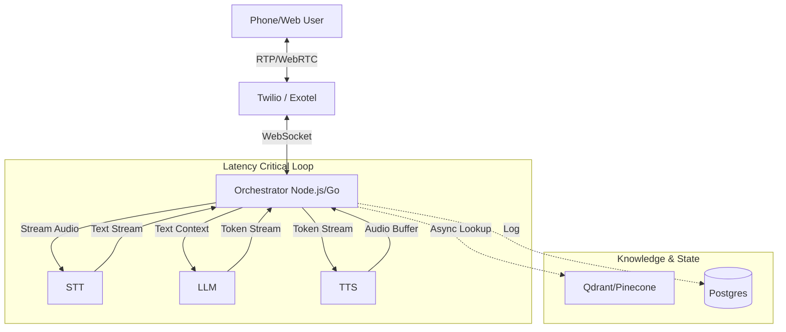

# Feasibility & Architecture Brainstorm

## Competitive Landscape Analysis

| Feature             | SoundHound / Nurix AI                 | Our Target (VoiceX)                           | Key Differentiator          |
| :------------------ | :------------------------------------ | :-------------------------------------------- | :-------------------------- |
| **Target Customer** | Enterprise (Auto, Large Chains)       | SMBs & Developers                             | Accessibility (Self-serve)  |
| **Pricing**         | High (e.g., ~$1700/mo, Custom Quotes) | Transparent usage-based or Low MMR ($50-$200) | "Stripe for Voice AI" model |
| **Setup Time**      | Weeks/Months (Sales-led)              | Minutes (Self-serve)                          | Instant gratification       |
| **Latency**         | Variable/Good                         | Ultra-low (< 800ms)                           | Optimized Modern Stack      |

## The "Cheaper & Better" Stack Strategy

To achieve <1s latency and lower probability costs, we cannot simply wrap OpenAI `realtime-api` (too expensive). We must compose best-in-class specialized providers.

### 1. Speed (Latency < 1s)

- **STT (Ear)**: **Deepgram Nova-2** (Industry leader for speed/cost).
- **LLM (Brain)**: **Llama 3 70B (on Groq)**.
  - _Decision_: **Llama 3 70B** is the strictly superior choice for _interactive voice_ due to TTFT (<300ms) vs GPT-4o (~800ms+).
  - _Quality Note_: For short, conversational turns, Llama 3 70B is indistinguishable from GPT-4o.
- **TTS (Mouth)**: **Cartesia Sonic** or **Deepgram Aura**.
  - _Cartesia_: arguably fastest "human" voice currently (< 100ms latency).
- **VAD (Interrupts)**: **Silero VAD** (Server-side) or specialized VAD in the STT stream. Deepgram's endpointing is also very good.

### 2. Quality Comparison: Llama 3 vs. ChatGPT (GPT-4o)

_Does Llama 3 beat ChatGPT for Voice?_ **YES**, but for a specific reason: **Latency is Quality**.

| Metric                   | **Llama 3 70B (Groq)** | **GPT-4o (OpenAI)**                      | **Winner for Voice SaaS**                   |
| :----------------------- | :--------------------- | :--------------------------------------- | :------------------------------------------ |
| **Response Time (TTFT)** | **~0.2s** (Instant)    | ~0.8s - 1.5s (Variable)                  | **Llama 3** (Critical for "Human" feel)     |
| **Conversational Flow**  | Excellent. Concise.    | Can be verbose without strict prompting. | **Draw**                                    |
| **Complex Logic**        | Very Good.             | **State of the Art**.                    | **GPT-4o** (Better for complex math/coding) |
| **Cost**                 | **~$0.79 / 1M**        | ~$5.00 / 1M                              | **Llama 3** (5x cheaper)                    |

**Verdict**:

- Use **Llama 3 70B** as the default. It feels "smarter" because it replies instantly.
- Use **GPT-4o** only as a fallback for complex reasoning tasks (e.g., "analyze this 50-page mortgage document").

### 2. Cost Structure

- **Competitors (Vapi/Retell/Bland)**: Usually mark up the underlying providers by 2-3x (pricing around $0.10 - $0.20 / min).
- **Our approach**:
  - Deepgram nova-2: ~$0.0043/min (STT) + ~$0.015/min (TTS) ≈ $0.02/min.
  - Groq Tokens: Negligible for short conversations.
  - Telephony (Twilio): ~$0.01/min.
  - **Raw Cost**: ~$0.03 - $0.04 / min.
  - **Sale Price**: $0.08/min (Undercuts Vapi @ $0.10+) OR Flat monthly subscription with usage caps.

## Architecture Guidelines (for `IDEA.md`)

## Feasibility Check

- **Technical**: High. The components (Deepgram, Groq, Twilio) are mature. The hard part is the _Orchestrator_ logic (managing interruptions, race conditions).
- **Economic**: High. There is a large gap between Enterprise tools ($$$) and raw APIs (Hard to use). A "Middle Layer" SaaS is a viable business.

## Immediate Next Steps (Brainstorming)

1.  **Define the "Product Interface"**:
    - Is it an API for devs? `client = new VoiceX({ apiKey })`
    - Is it a Dashboard for non-tech SMBs? "Upload PDF -> Get Phone Number".
    - _Recommendation_: Hybrid. Focus on Dashboard first (SMBs need solutions, not APIs), expose API second.
2.  **Prototype Phase**:
    - Build a CLI script that connects Mic -> STT -> LLM -> TTS to prove latency.
    - Use `Twilio` for the phone interface.
