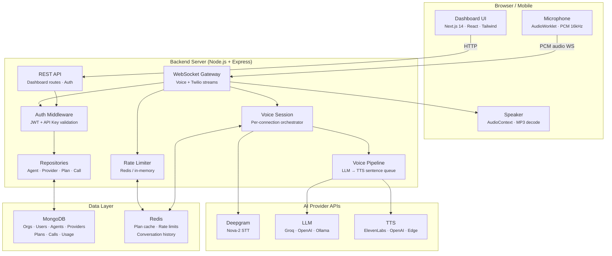
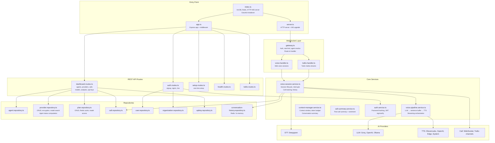
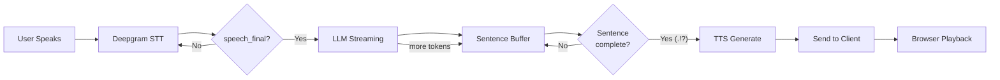
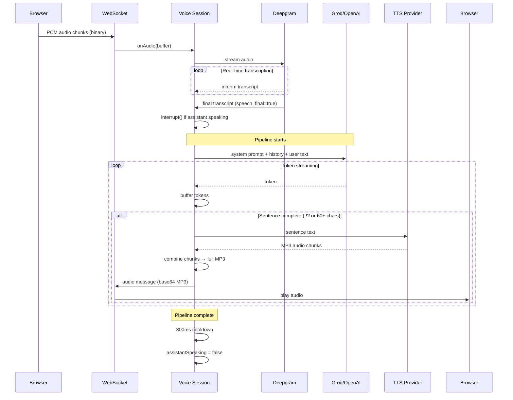
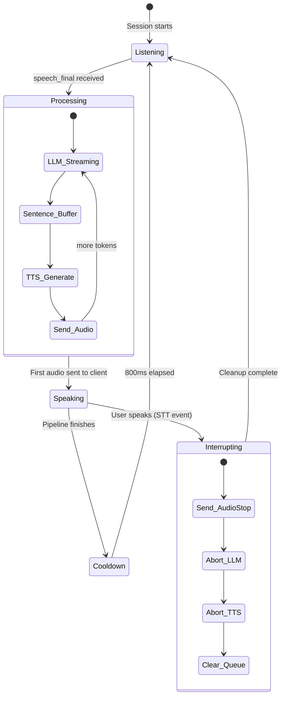
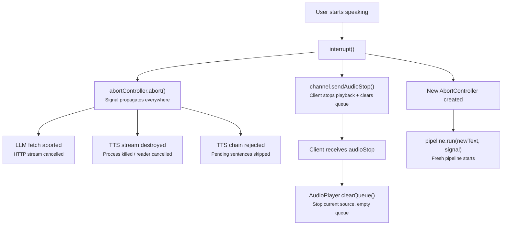
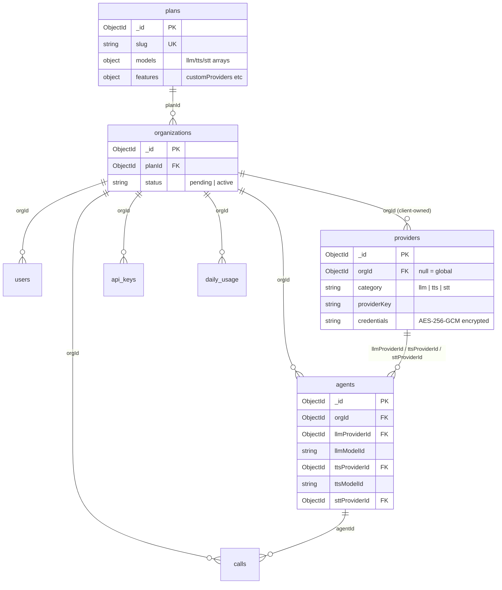
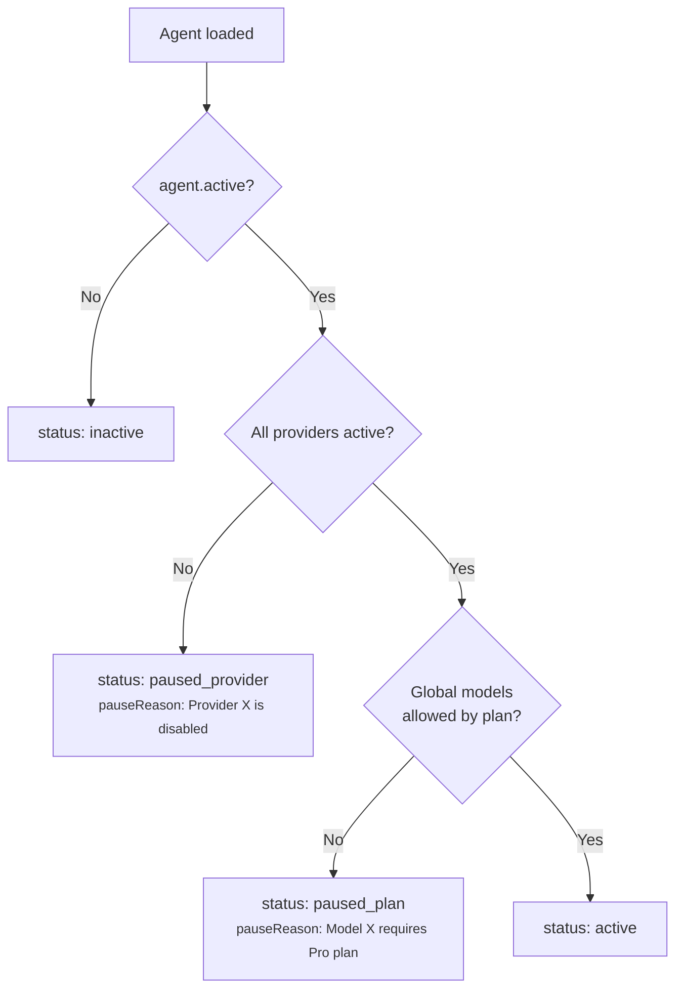
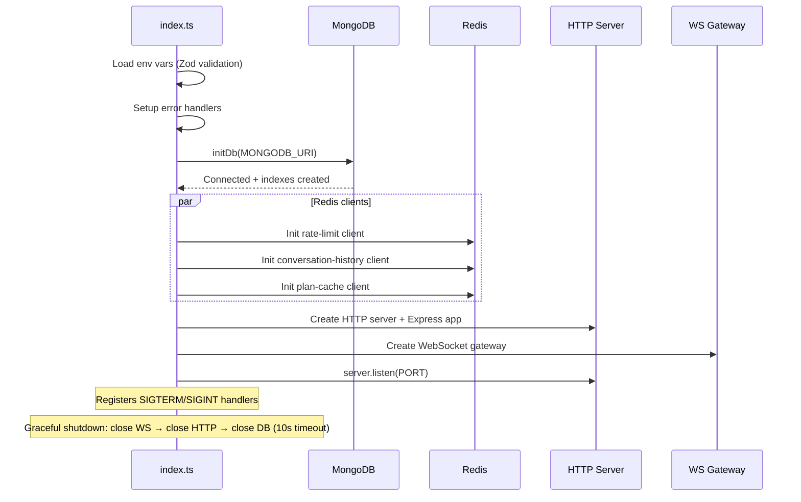

# Architecture

How Voicex is structured — from the database layer to real-time voice streaming.

---

## High-Level System Overview

Voicex is a multi-tenant SaaS platform with two main subsystems:

1. **Dashboard** — REST API + Next.js frontend for managing agents, providers, calls, and settings.
2. **Voice Engine** — WebSocket-based real-time pipeline for STT → LLM → TTS conversations.



---

## Project Structure

```
voicex/
├── frontend/                        # Next.js 14 (port 3000)
│   └── src/
│       ├── app/                     # App Router pages
│       │   ├── login/               # Sign in
│       │   ├── signup/              # Sign up
│       │   ├── pending/             # Account pending verification
│       │   └── dashboard/           # Protected dashboard
│       │       ├── agents/          # Agent list + detail/edit
│       │       ├── calls/           # Call list + detail
│       │       ├── playground/      # Live voice testing
│       │       ├── analytics/       # Usage charts
│       │       ├── settings/        # Account, API keys, provider link
│       │       └── providers/       # Custom provider management
│       ├── components/              # VoiceAssistant, Toast, ConfirmDialog, etc.
│       ├── lib/                     # API client, plan context, voice hook
│       └── utils/                   # cn() class utility
│
├── backend/                         # Node.js + Express + WS (port 3001)
│   └── src/
│       ├── db/                      # schema.ts (interfaces), client.ts (connection)
│       ├── repositories/            # Data access: agent, provider, plan, call, user, org, apikey
│       ├── routes/                  # REST endpoints: auth, dashboard, health, setup, twilio
│       ├── services/                # Voice session, pipeline, context, call summary, auth
│       ├── handlers/                # WebSocket connection handlers (voice, twilio)
│       ├── ws/                      # WebSocket gateway (routing, auth, rate limit)
│       ├── middleware/              # Auth, rate-limit, API limiter
│       ├── providers/               # STT (Deepgram), LLM (Groq/OpenAI/Ollama), TTS (ElevenLabs/OpenAI/Edge/System), Call channels
│       ├── shared/                  # Logger, errors, encryption, audio utils, WS types
│       ├── config/                  # Environment (Zod), voice config
│       └── scripts/                 # Seed plans, seed providers, seed test data, migrations
│
├── docs/                            # This documentation (VitePress)
│   └── src/
│
└── scripts/                         # Bash helpers for seed scripts
```

---

## Backend Component Map



---

## Real-Time Voice Pipeline

The core pipeline processes a single conversational turn. Each stage streams data to the next — the AI starts speaking before it finishes thinking.



### Detailed Data Flow (One Turn)



---

## Interrupt & Echo Suppression

When the user starts talking while the assistant is speaking, the system immediately stops and listens.



**Echo suppression:** While `assistantSpeaking = true`, ALL STT events are suppressed. After the pipeline finishes, an 800ms cooldown prevents tail-end speaker audio from triggering false interrupts.

**Interruption sensitivity levels:**

| Level | Min chars to trigger | Use case |
|-------|---------------------|----------|
| `low` | 5 characters | Formal conversations, reduce false interrupts |
| `medium` (default) | 2 characters | Balanced |
| `high` | 1 character | Fast-paced, customer support |

---

## Abort Chain

Every async operation accepts `AbortSignal` so nothing leaks when the user interrupts.



---

## Data Architecture

See [Database Schema](./database) for full details. Here's the relationship overview:



### Key Relationships

| From | To | Field | Description |
|------|------|-------|-------------|
| `organizations` | `plans` | `planId` | Which plan the org is on |
| `agents` | `providers` | `llmProviderId` | Which LLM provider the agent uses |
| `agents` | `providers` | `ttsProviderId` | Which TTS provider the agent uses |
| `agents` | `providers` | `sttProviderId` | Which STT provider the agent uses |
| `providers` | `organizations` | `orgId` | Owner org (`null` = global/platform provider) |
| `calls` | `agents` | `agentId` | Which agent handled the call |

---

## Provider Architecture

Providers are stored in a single unified `providers` collection. There are two types:

| Type | `orgId` | Who manages | Example |
|------|---------|------------|---------|
| **Global** | `null` | Platform admin | Groq, OpenAI, Ollama, ElevenLabs, Edge, Deepgram |
| **Client** | `<orgId>` | Client via dashboard | Client's own OpenAI key, custom ElevenLabs voice |

When an agent references a provider (e.g., `llmProviderId`), the system:
1. Fetches the provider document
2. If global (`orgId: null`), checks the org's plan allows the selected model
3. If client-owned, allows it (client providers bypass plan model checks)
4. Decrypts credentials at runtime using AES-256-GCM

See [Providers](./providers) for full details.

---

## Agent Status Computation

Agent status is computed **server-side** by checking three conditions:



| Status | Meaning | User action |
|--------|---------|-------------|
| `active` | Agent is fully operational | None |
| `inactive` | Agent is manually deactivated | Toggle active on |
| `paused_provider` | A referenced provider is disabled | Edit agent to use different provider, or re-enable provider |
| `paused_plan` | A global model requires a higher plan | Upgrade plan or switch to a model included in current plan |

---

## Latency Breakdown

Where time goes in a typical voice turn:

| Stage | Provider | Typical Latency |
|-------|----------|----------------|
| STT endpointing | Deepgram | ~300ms |
| LLM first token | Groq | ~150-250ms |
| TTS first audio | ElevenLabs | ~200-300ms |
| Network + decode | WebSocket | ~50-100ms |
| **Total to first audio** | | **~700-950ms** |

---

## Startup Sequence


