# Architecture

How Voicex processes voice in real-time — from microphone to speaker in under a second.

---

## High-Level System Overview

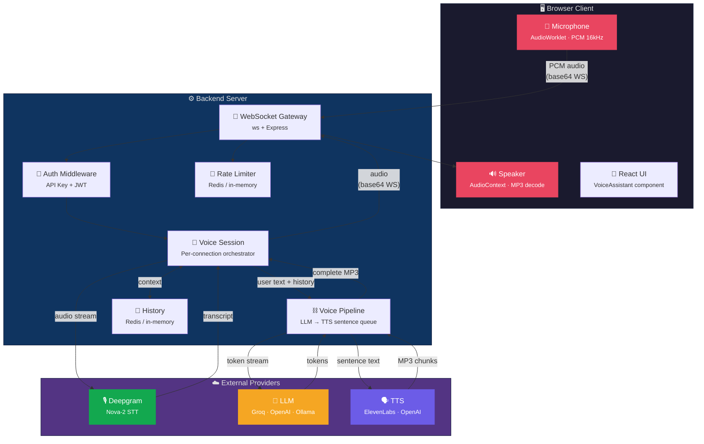

---

## Real-Time Voice Pipeline

The core pipeline processes a single conversational turn. Each stage streams data to the next — the AI starts speaking before it finishes thinking.

```mermaid
flowchart LR
    A["🎤 User Speaks"] --> B["📡 Deepgram STT"]
    B --> C{"speech_final?"}
    C -->|"No"| B
    C -->|"Yes"| D["🧠 LLM Streaming"]
    D --> E["📝 Sentence Buffer"]
    E --> F{"Sentence\ncomplete?"}
    F -->|"No (< 60 chars)"| E
    F -->|"Yes (.!?)"| G["🗣️ TTS Generate"]
    G --> H["🔊 Send to Client"]
    D -->|"more tokens"| E
    H --> I["▶️ Browser Playback"]

    style A fill:#e94560,stroke:#e94560,color:#fff
    style B fill:#13a84f,stroke:#13a84f,color:#fff
    style D fill:#f5a623,stroke:#f5a623,color:#fff
    style G fill:#6c5ce7,stroke:#6c5ce7,color:#fff
    style I fill:#e94560,stroke:#e94560,color:#fff
    style C fill:#16213e,stroke:#e0e0e0,color:#e0e0e0
    style F fill:#16213e,stroke:#e0e0e0,color:#e0e0e0
```

---

## Detailed Data Flow (One Turn)

---

## Interrupt & Echo Suppression

When the user starts talking while the assistant is speaking, the system must immediately stop and listen. This is the most critical real-time behavior.

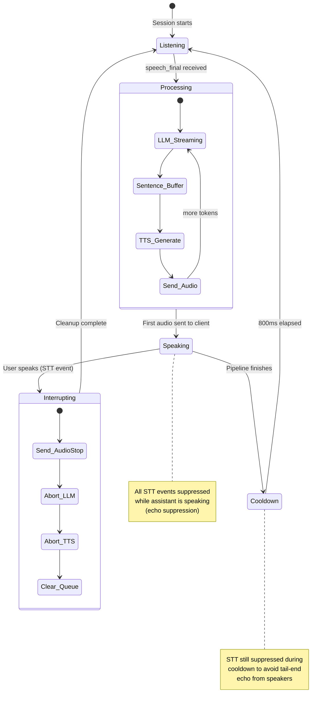

---

## Abort Chain

Every async operation accepts `AbortSignal` so nothing leaks when the user interrupts.

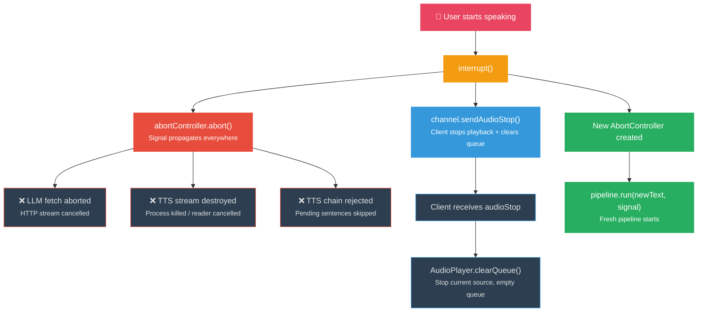

---

## Provider Selection

Providers are chosen based on environment configuration and available API keys.

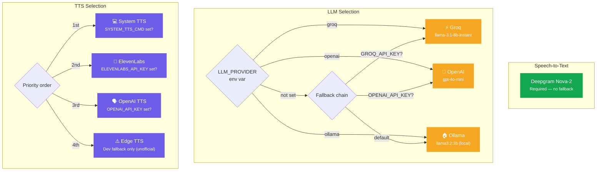

---

## WebSocket Message Flow

All client-server communication happens over a single WebSocket connection.

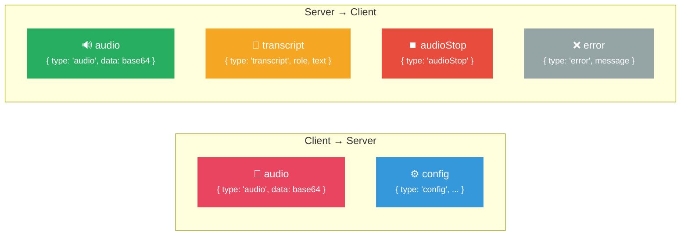

---

## Backend Component Map

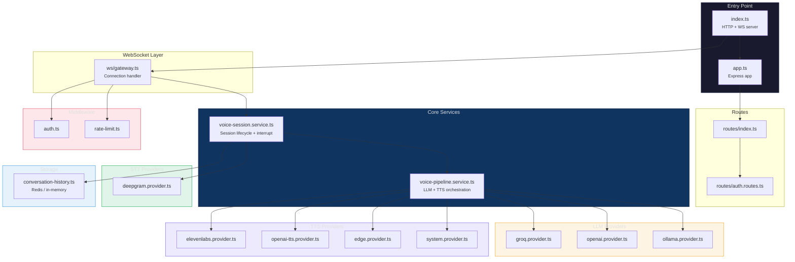

---

## Frontend Component Map

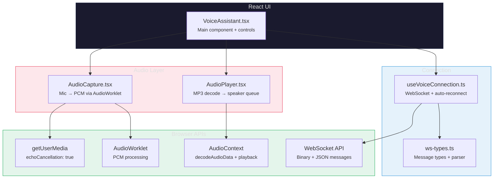

---

## Deployment Architecture

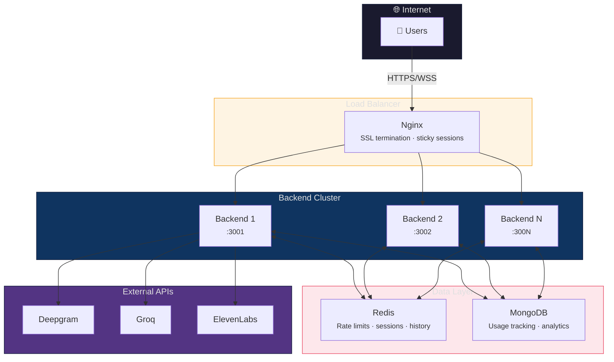

---

## Latency Breakdown

Where time goes in a typical voice turn:

```mermaid
gantt
    title Typical Turn Latency (~800ms total)
    dateFormat X
    axisFormat %L ms

    section STT
    Deepgram endpointing     :done, stt, 0, 300

    section LLM
    Groq first token          :active, llm, 300, 500

    section TTS
    ElevenLabs first audio    :tts1, 500, 700

    section Playback
    Browser starts playing    :crit, play, 700, 800
```

| Stage                    | Provider   | Typical Latency |
| ------------------------ | ---------- | --------------- |
| STT endpointing          | Deepgram   | ~300ms          |
| LLM first token          | Groq       | ~150-250ms      |
| TTS first audio          | ElevenLabs | ~200-300ms      |
| Network + decode         | WebSocket  | ~50-100ms       |
| **Total to first audio** |            | **~700-950ms**  |

---

## Key Design Decisions

### Echo Suppression

When the assistant is speaking, the mic picks up audio from speakers. Without handling, this creates a feedback loop:

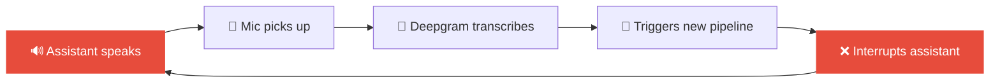

**Solution:** While `assistantSpeaking = true`, ALL STT events are suppressed. After the pipeline finishes, an 800ms cooldown prevents the tail end of speaker audio from triggering false interrupts.

### Sentence-Level Audio Streaming

TTS providers return streaming MP3 chunks, but individual chunks aren't decodable by browsers. The solution is sentence-level buffering:

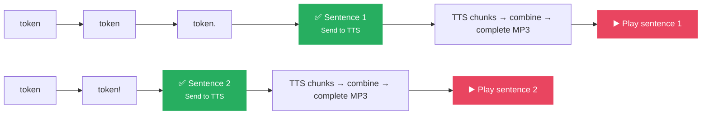

Audio starts playing before the full LLM response is generated. Each sentence plays as soon as its TTS is ready — while the LLM continues generating the next sentence.
