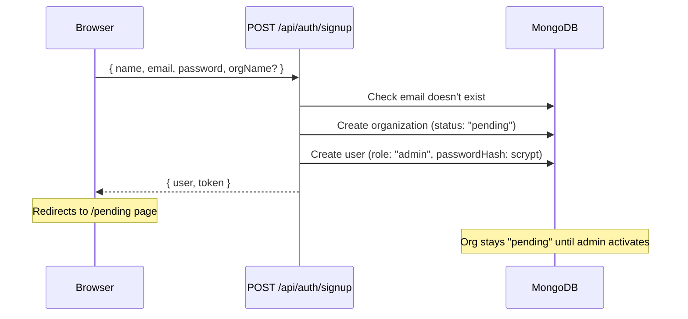
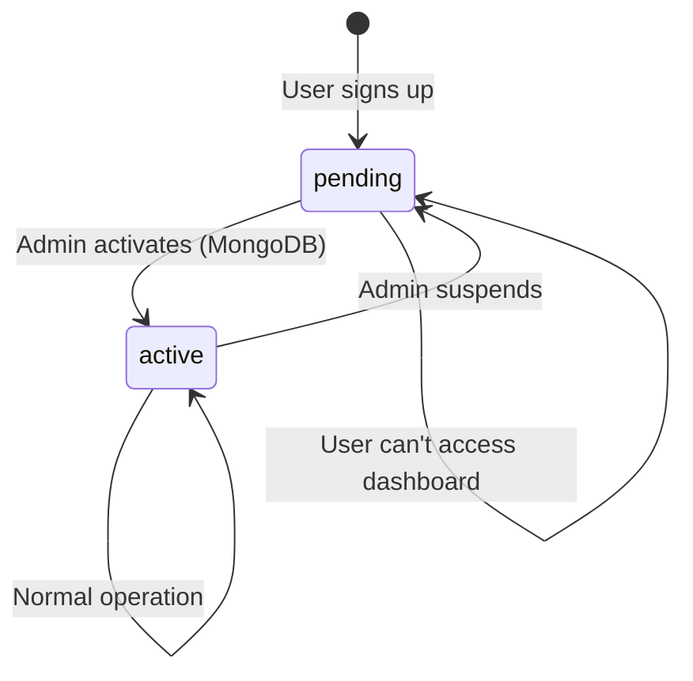
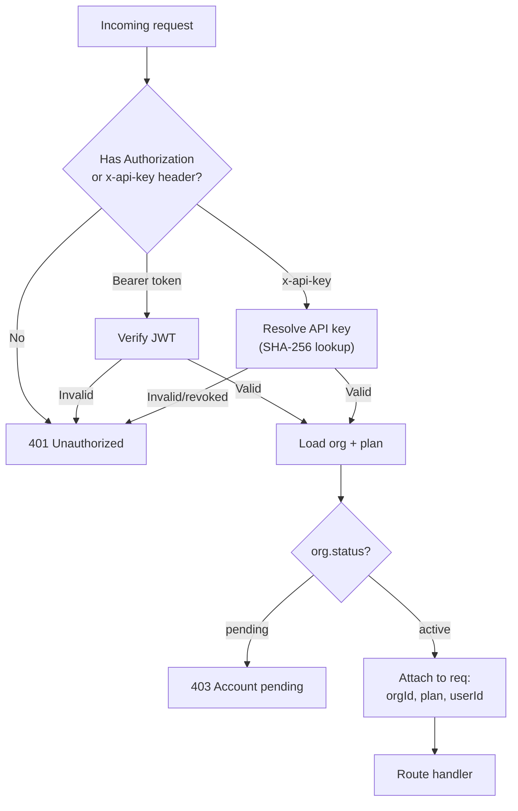
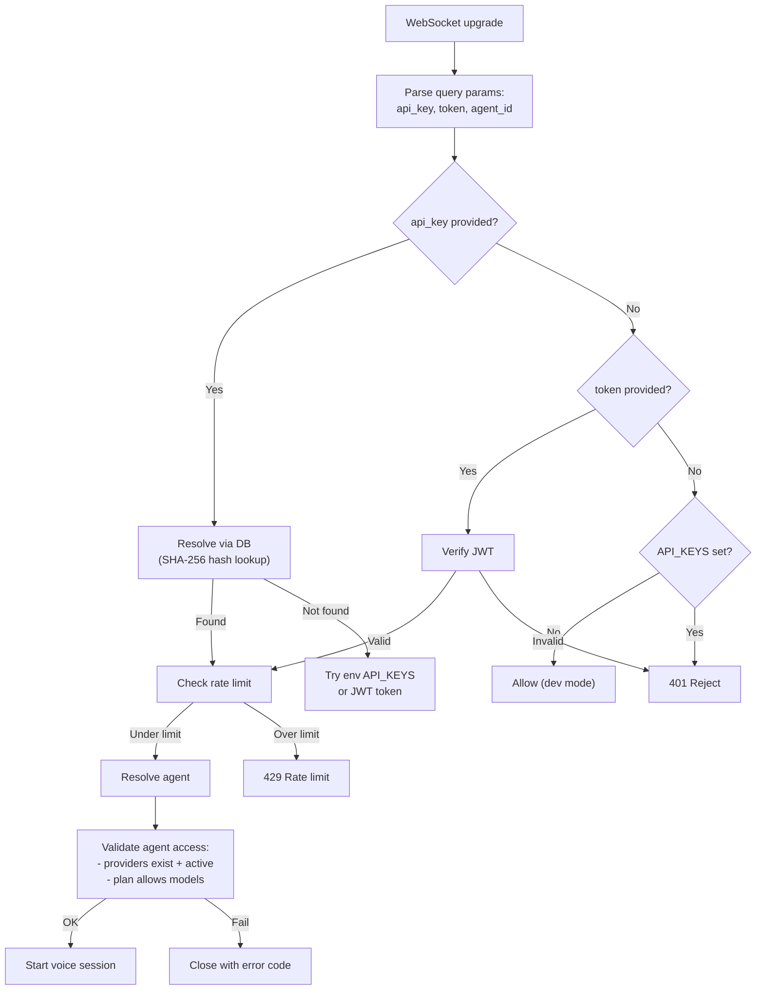

# Authentication

Voicex uses a multi-layer auth system: user accounts (JWT) for the dashboard, and API keys for external voice integrations.

---

## Overview

| Auth method | Used for | Format | Lifetime |
|-------------|----------|--------|----------|
| **JWT (Bearer token)** | Dashboard login, REST API | `Authorization: Bearer <token>` | Configurable (`JWT_EXPIRES_IN`, default 1h) |
| **API key** | External voice integrations, WebSocket | `x-api-key: vx_...` or `?api_key=vx_...` | Until revoked |

---

## User Authentication Flow

### Signup



**Request:**

```bash
POST /api/auth/signup
Content-Type: application/json

{
  "name": "John Doe",
  "email": "john@company.com",
  "password": "min8chars",
  "orgName": "Acme Corp"    # optional, defaults to "Organization"
}
```

**Response:**

```json
{
  "user": { "id": "...", "email": "john@company.com", "name": "John Doe", "role": "admin" },
  "token": "eyJhbG..."
}
```

**What happens:**
1. Organization created with `status: 'pending'` and linked to the `free` plan
2. User created with `role: 'admin'`
3. JWT issued immediately (but dashboard will check org status)

### Signin

```bash
POST /api/auth/signin
Content-Type: application/json

{
  "email": "john@company.com",
  "password": "min8chars"
}
```

**Response:**

```json
{
  "user": { "id": "...", "email": "john@company.com", "name": "John Doe", "role": "admin" },
  "organization": { "id": "...", "name": "Acme Corp", "status": "active" },
  "token": "eyJhbG..."
}
```

**If org status is `"pending"`**, the response includes `status: "pending"` and the frontend redirects to `/pending`.

### Get Current User

```bash
GET /api/auth/me
Authorization: Bearer <token>
```

Returns the authenticated user, organization, and status.

---

## Organization Status Lifecycle



| Status | Can sign in? | Can access dashboard? | Can use voice API? |
|--------|-------------|----------------------|-------------------|
| `pending` | Yes (gets token) | No (redirected to /pending) | No (403) |
| `active` | Yes | Yes | Yes |

**Activate an organization:**

```javascript
db.organizations.updateOne(
  { ownerEmail: "john@company.com" },
  { $set: { status: "active", updatedAt: new Date() } }
)
```

---

## JWT Token

**Algorithm:** HS256 (HMAC-SHA256) via the `jose` library.

**Payload:**

```json
{
  "userId": "ObjectId hex string",
  "orgId": "ObjectId hex string",
  "email": "john@company.com",
  "iat": 1708000000,
  "exp": 1708003600
}
```

**Configuration:**

| Env var | Default | Description |
|---------|---------|-------------|
| `JWT_SECRET` | — | **Required.** Signing key, min 32 characters |
| `JWT_EXPIRES_IN` | `1h` | Token lifetime (e.g., `1h`, `30m`, `7d`) |

**Where the token is stored:** `localStorage.vx_token` in the browser.

---

## API Keys

API keys are for external integrations — embedding the voice agent in a client's app, or using the REST API programmatically.

### Key Format

```
vx_a1b2c3d4e5f6a1b2c3d4e5f6a1b2c3d4e5f6a1b2c3d4e5f6
│   └─────────────────── 48 hex characters ──────────────────┘
└── prefix
```

### Key Security

- The raw key is returned **exactly once** at creation time
- Only the **SHA-256 hash** is stored in the database
- The `keyPrefix` (first ~10 chars) is stored for display purposes
- Resolution: incoming key → SHA-256 → match against `keyHash` in DB

### Create an API Key

```bash
POST /api/dashboard/api-keys
Authorization: Bearer <token>
Content-Type: application/json

{
  "name": "Production Key"
}
```

**Response (key shown only once):**

```json
{
  "id": "...",
  "name": "Production Key",
  "keyPrefix": "vx_a1b2c3",
  "rawKey": "vx_a1b2c3d4e5f6...full_key_here",
  "createdAt": "2024-01-15T..."
}
```

### Use an API Key

**In REST API headers:**

```bash
curl -H "x-api-key: vx_a1b2c3d4e5f6..." \
  http://localhost:3001/api/dashboard/agents
```

**In WebSocket URL:**

```
ws://localhost:3001/ws/voice?api_key=vx_a1b2c3d4e5f6...
```

### Revoke an API Key

```bash
DELETE /api/dashboard/api-keys/:id
Authorization: Bearer <token>
```

Revoked keys are **not deleted** — they're marked with `revokedAt` and will fail authentication.

---

## Dashboard Auth Middleware

Every `/api/dashboard/*` route goes through `authMiddleware()`:



The middleware attaches to every request:
- `req.orgId` — organization ObjectId
- `req.plan` — cached plan with `modelSets` for O(1) access checks
- `req.userId` — user ObjectId (if JWT auth)

---

## WebSocket Auth

The WebSocket gateway (`ws/gateway.ts`) authenticates voice connections:



**Rate limit:** 30 connections per minute per client.

---

## Password Hashing

Passwords are hashed using Node.js `crypto.scryptSync`:

| Parameter | Value |
|-----------|-------|
| Algorithm | scrypt |
| Salt | 16 random bytes (hex) |
| Key length | 64 bytes |
| Storage format | `salt_hex:hash_hex` |
| Comparison | `crypto.timingSafeEqual` (constant-time) |
