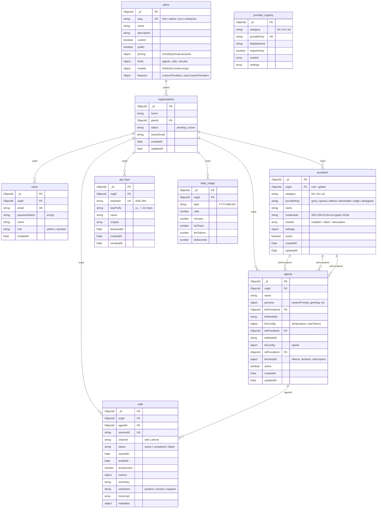

# Database Schema

Complete reference for every MongoDB collection, field, index, and relationship in Voicex.

All interfaces are defined in `backend/src/db/schema.ts`. Indexes are created in `backend/src/db/client.ts`.

---

## Overview

Voicex uses **MongoDB** as its primary database. There are **9 collections**:

| Collection | Purpose | Key relationships |
|------------|---------|-------------------|
| `plans` | Subscription tiers with model access and limits | Referenced by `organizations.planId` |
| `organizations` | Tenant accounts | References `plans`, owns `users`, `agents`, `providers`, `calls` |
| `users` | Login accounts | Belongs to an `organization` |
| `providers` | LLM/TTS/STT provider configs (global + client) | Referenced by `agents` via FK |
| `provider_registry` | Read-only catalog of supported provider types | Not referenced by other collections |
| `agents` | AI voice agent configurations | References `providers` (3 FKs), belongs to `organization` |
| `api_keys` | API keys for external integrations | Belongs to `organization` |
| `calls` | Voice call records with transcripts | Belongs to `organization` + `agent` |
| `daily_usage` | Aggregated daily usage metrics | Belongs to `organization` |

---

## Entity Relationship Diagram



---

## Collection Details

### `plans`

Defines subscription tiers. Each plan controls which models are accessible, how many agents can be created, and whether custom providers are allowed.

```typescript
interface Plan {
  _id?: ObjectId;
  slug: string;             // "free" | "starter" | "pro" | "enterprise"
  name: string;             // "Free" | "Starter" | "Pro" | "Enterprise"
  description: string;
  custom: boolean;          // true = custom plan for specific client
  public: boolean;          // true = shown on pricing page
  pricing: {
    monthly: number;        // e.g. 0, 29, 99, 499
    annual: number;         // e.g. 0, 290, 990, 4990
    maxDiscountPercent: number;
  };
  limits: {
    maxAgents: number;
    maxConcurrentCalls: number;
    maxCallDurationSec: number;
    maxMonthlyMinutes: number;
  };
  models: {
    llm: string[];          // e.g. ["ollama/llama3.2:3b", "groq/llama-3.3-70b-versatile"]
    tts: string[];          // e.g. ["edge/en-US-AriaNeural"]
    stt: string[];          // e.g. ["deepgram/nova-2"]
  };
  features: {
    customProviders: boolean;     // can client add own provider keys?
    maxCustomProviders: number;   // how many?
  };
  createdAt: Date;
  updatedAt: Date;
}
```

**Model string format:** `providerKey/modelId` (e.g., `groq/llama-3.3-70b-versatile`, `elevenlabs/21m00Tcm4TlvDq8ikWAM`).

**Indexes:**

| Fields | Type | Purpose |
|--------|------|---------|
| `slug` | Unique | Lookup by slug |
| `public, custom` | Compound | List public non-custom plans for pricing page |

**Standard plans:**

| Plan | Agents | Concurrent | Duration | Monthly Min | Custom Providers |
|------|--------|-----------|----------|-------------|-----------------|
| free | 1 | 2 | 5 min | 60 | No |
| starter | 5 | 10 | 30 min | 1,000 | 1 |
| pro | 25 | 50 | 60 min | 10,000 | 5 |
| enterprise | 999 | 500 | 120 min | 100,000 | 100 |

---

### `organizations`

A tenant account. Every user, agent, provider, and call belongs to exactly one organization.

```typescript
interface Organization {
  _id?: ObjectId;
  name: string;
  planId: ObjectId;        // FK → plans._id
  status: 'pending' | 'active';
  ownerEmail: string;
  createdAt: Date;
  updatedAt: Date;
}
```

**Lifecycle:**
1. User signs up → org created with `status: 'pending'`
2. Admin activates → `status: 'active'`
3. User can now sign in and access dashboard
4. If set back to `pending`, all API access is blocked

**Indexes:**

| Fields | Purpose |
|--------|---------|
| `name` | Search by name |
| `planId` | Find orgs on a specific plan |
| `status` | Filter active/pending |

---

### `users`

Login accounts. Each user belongs to one organization.

```typescript
interface User {
  _id?: ObjectId;
  orgId: ObjectId;           // FK → organizations._id
  email: string;             // unique across all orgs
  passwordHash: string;      // scrypt (salt:hash format)
  name: string;
  role: 'admin' | 'member';
  createdAt: Date;
}
```

**Password hashing:** Uses Node.js `crypto.scryptSync` with 16-byte random salt. Format: `salt_hex:hash_hex`. Timing-safe comparison via `crypto.timingSafeEqual`.

**Indexes:**

| Fields | Type | Purpose |
|--------|------|---------|
| `email` | Unique | Login lookup, prevent duplicates |
| `orgId` | Standard | List users in org |

---

### `providers`

Unified collection for both global (platform-managed) and client-owned providers. This is the core of the relational provider architecture.

```typescript
interface ProviderModel {
  modelId: string;           // e.g. "llama-3.3-70b-versatile"
  label: string;             // e.g. "Llama 3.3 70B"
  description?: string;
}

interface Provider {
  _id?: ObjectId;
  orgId: ObjectId | null;    // null = global (platform-owned)
  category: 'llm' | 'tts' | 'stt';
  providerKey: string;       // "groq", "openai", "ollama", "elevenlabs", "edge", "deepgram"
  name: string;              // Display name, e.g. "Groq Cloud"
  credentials: string;       // AES-256-GCM encrypted JSON string
  models: ProviderModel[];   // Models available through this provider
  settings: Record<string, unknown>;  // e.g. { ollamaBaseUrl: "..." }
  active: boolean;
  createdAt: Date;
  updatedAt: Date;
}
```

**Two types of providers:**

| Type | `orgId` value | Created by | Example |
|------|---------------|-----------|---------|
| Global | `null` | `seed-global-providers.ts` | Platform's Groq account |
| Client | `<ObjectId>` | Client via dashboard | Client's own OpenAI API key |

**Credential encryption:**
- Algorithm: AES-256-GCM
- Key: `ENCRYPTION_KEY` env var (64-char hex = 32 bytes)
- Stored format: `iv_hex:authTag_hex:ciphertext_hex`
- Credentials are a JSON object like `{"apiKey": "gsk_..."}` encrypted at rest
- Decrypted only at runtime when starting a voice session

**Indexes:**

| Fields | Type | Purpose |
|--------|------|---------|
| `orgId, category` | Compound | List providers for an org by type |
| `orgId, category, providerKey, name` | Unique | Prevent duplicate provider names per org |
| `orgId, active` | Compound | Filter active providers |

---

### `provider_registry`

Read-only catalog of all supported provider types and their available models. Used by the frontend to render the "Add Provider" form.

```typescript
interface ProviderRegistryEntry {
  _id?: ObjectId;
  category: 'llm' | 'tts' | 'stt';
  providerKey: string;
  displayName: string;
  requiresKey: boolean;
  models: { modelId: string; label: string; description?: string }[];
  settings: { key: string; label: string; type: string; required: boolean }[];
  createdAt: Date;
}
```

**Indexes:**

| Fields | Type | Purpose |
|--------|------|---------|
| `category, providerKey` | Unique | Prevent duplicates |

---

### `agents`

AI voice agent configurations. Agents reference providers via foreign keys — they do NOT embed provider configs.

```typescript
interface AgentPersona {
  systemPrompt: string;
  greeting: string;
  personality: string;
  language: string;
  guardrails: string;
}

interface AgentLLMConfig {
  temperature: number;    // 0.0 - 2.0, default 0.4
  maxTokens: number;      // default 200
}

interface AgentTTSConfig {
  speed: number;          // default 1.0
}

interface AgentThresholds {
  silenceTimeoutMs: number;            // default 700
  maxCallDurationSec: number;          // default 1800 (30 min)
  interruptionSensitivity: 'low' | 'medium' | 'high';  // default 'medium'
  endpointingMs: number;               // default 200
}

interface Agent {
  _id?: ObjectId;
  orgId: ObjectId;                     // FK → organizations._id
  name: string;
  persona: AgentPersona;

  // LLM configuration (relational)
  llmProviderId: ObjectId;             // FK → providers._id
  llmModelId: string;                  // e.g. "llama-3.3-70b-versatile"
  llmConfig: AgentLLMConfig;

  // TTS configuration (relational)
  ttsProviderId: ObjectId;             // FK → providers._id
  ttsModelId: string;                  // e.g. "21m00Tcm4TlvDq8ikWAM"
  ttsConfig: AgentTTSConfig;

  // STT configuration (relational)
  sttProviderId: ObjectId;             // FK → providers._id

  thresholds: AgentThresholds;
  active: boolean;
  createdAt: Date;
  updatedAt: Date;
}
```

**Agent status** (computed server-side, not stored):

```typescript
type AgentStatus = 'active' | 'inactive' | 'paused_provider' | 'paused_plan';

interface AgentWithStatus extends Agent {
  status: AgentStatus;
  pauseReason?: string;
}
```

**Defaults:**

```typescript
const DEFAULT_AGENT_PERSONA = {
  systemPrompt: "You are a helpful voice assistant...",
  greeting: "Hello! How can I help you today?",
  personality: "friendly and professional",
  language: "en-US",
  guardrails: "Keep responses concise (1-3 sentences)..."
};

const DEFAULT_LLM_CONFIG = { temperature: 0.4, maxTokens: 200 };
const DEFAULT_TTS_CONFIG = { speed: 1.0 };
const DEFAULT_AGENT_THRESHOLDS = {
  silenceTimeoutMs: 700,
  maxCallDurationSec: 1800,
  interruptionSensitivity: 'medium',
  endpointingMs: 200
};
```

**Indexes:**

| Fields | Purpose |
|--------|---------|
| `orgId, active` | List active agents for org |
| `orgId, createdAt` | Sort agents by creation |
| `llmProviderId` | Find agents using a specific LLM provider (delete guard) |
| `ttsProviderId` | Find agents using a specific TTS provider (delete guard) |
| `sttProviderId` | Find agents using a specific STT provider (delete guard) |

---

### `api_keys`

API keys for external integrations (client's app calling the voice WebSocket).

```typescript
interface ApiKey {
  _id?: ObjectId;
  orgId: ObjectId;
  keyHash: string;           // SHA-256 hash of full key
  keyPrefix: string;         // "vx_" + first 10 hex chars (for display)
  name: string;
  scopes: string[];          // e.g. ["voice", "dashboard"]
  lastUsedAt: Date | null;
  createdAt: Date;
  revokedAt: Date | null;    // null = active, Date = revoked
}
```

**Key format:** `vx_` followed by 48 random hex characters.

**Security:** Only the SHA-256 hash is stored. The raw key is returned exactly once at creation time. Resolution works by hashing the incoming key and matching against `keyHash`.

**Indexes:**

| Fields | Type | Purpose |
|--------|------|---------|
| `orgId` | Standard | List keys for org |
| `keyHash` | Unique | Resolve incoming API key |
| `keyPrefix` | Standard | Display/identify keys |

---

### `calls`

Records of voice sessions with full transcripts and metrics.

```typescript
interface Call {
  _id?: ObjectId;
  orgId: ObjectId;
  agentId: ObjectId;
  sessionId: string;          // UUID, unique
  channel: 'web' | 'phone';
  status: 'active' | 'completed' | 'failed';
  startedAt: Date;
  endedAt?: Date;
  durationSec?: number;
  metrics: {
    ttfbMs: number;           // Time to first byte (first audio)
    avgLatencyMs: number;
    totalTokens: number;      // LLM tokens consumed
    ttsChars: number;         // TTS characters generated
    interruptions: number;    // How many times user interrupted
    turnCount: number;        // Number of conversation turns
  };
  summary?: string;           // AI-generated post-call summary
  sentiment?: 'positive' | 'neutral' | 'negative';
  transcript: TranscriptMessage[];
  metadata?: Record<string, unknown>;
  createdAt: Date;
}

interface TranscriptMessage {
  role: 'user' | 'assistant';
  text: string;
  timestamp: number;
}
```

**Indexes:**

| Fields | Purpose |
|--------|---------|
| `orgId, createdAt` | List calls for org (sorted) |
| `orgId, agentId, createdAt` | List calls for specific agent |
| `sessionId` (unique) | Look up by session |
| `status` | Filter active/completed |
| `orgId, status` | Active calls for org |

---

### `daily_usage`

Aggregated daily metrics per organization. Updated atomically when calls end.

```typescript
interface DailyUsage {
  _id?: ObjectId;
  orgId: ObjectId;
  date: string;              // "YYYY-MM-DD"
  calls: number;
  minutes: number;
  ttsChars: number;
  llmTokens: number;
  sttSeconds: number;
}
```

**Indexes:**

| Fields | Type | Purpose |
|--------|------|---------|
| `orgId, date` | Unique | One record per org per day |
| `orgId, date (desc)` | Standard | Query recent usage |

---

## Redis Data

Redis is used as an optional cache/session layer. If `REDIS_URL` is not set, the system falls back to in-memory Maps.

| Key pattern | TTL | Purpose |
|-------------|-----|---------|
| `plan:{planId}` | 10 min | Cached plan document (avoids DB hits on every request) |
| `rl:{clientId}` | 60 sec | Rate limit counter (30 connections/min) |
| `voice:history:{sessionKey}` | 24 hours | Conversation message history (max 20 messages) |

### Plan Cache Strategy

```
Request → L1 Cache (in-memory Map, 1 min TTL)
  ├── HIT → return cached plan
  └── MISS → L2 Cache (Redis, 10 min TTL)
              ├── HIT → populate L1, return
              └── MISS → MongoDB query
                          ├── populate L1 + L2, return
```

The cached plan includes pre-computed `modelSets` (JavaScript `Set` objects) for O(1) model access checks:

```typescript
interface CachedPlan extends Plan {
  modelSets: {
    llm: Set<string>;   // e.g. Set(["ollama/llama3.2:3b", "groq/llama-3.3-70b-versatile"])
    tts: Set<string>;
    stt: Set<string>;
  };
}
```

---

## Database Connection

Configured in `backend/src/db/client.ts`.

| Setting | Value |
|---------|-------|
| Max pool size | 100 (configurable via `MONGODB_MAX_POOL_SIZE`) |
| Min pool size | 10 |
| Idle timeout | 60 seconds |
| Server selection timeout | 5 seconds |
| Connect timeout | 10 seconds |

All indexes are created automatically on startup via `initDb()`.
