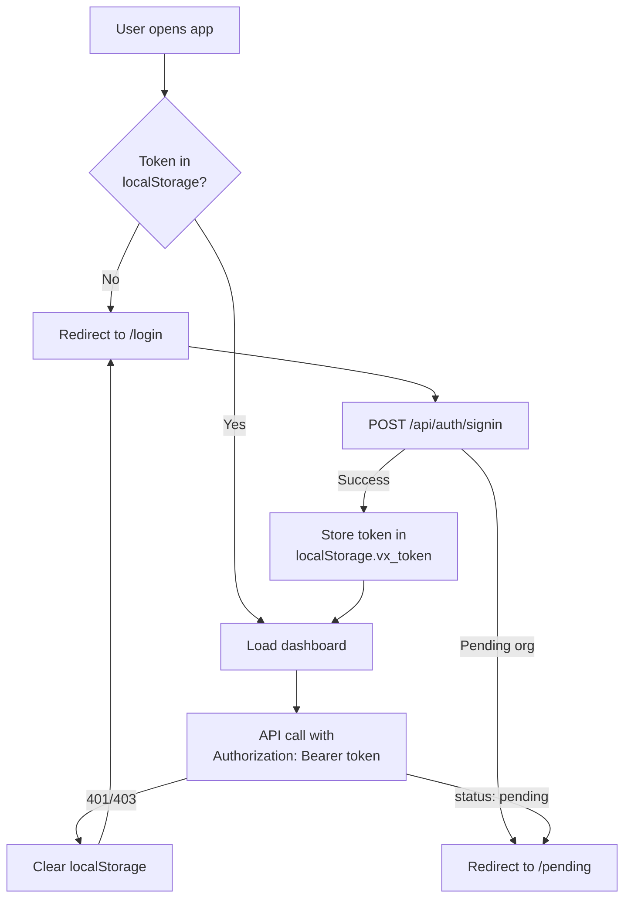
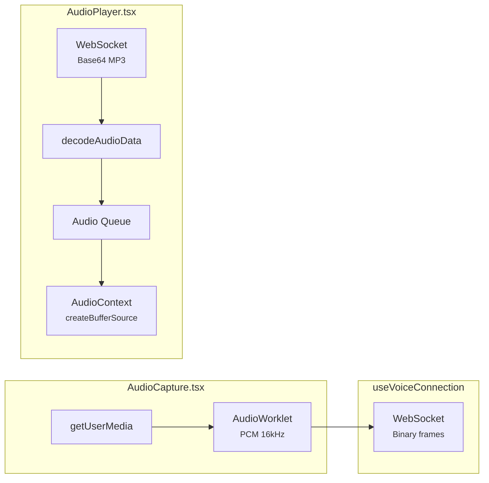

# Frontend Architecture

The Voicex frontend is a **Next.js 14 App Router** application using **React 18**, **Tailwind CSS**, and **TypeScript**. It provides the multi-tenant dashboard for managing agents, providers, calls, and analytics, plus a live voice playground.

---

## Tech Stack

| Technology | Purpose |
|------------|---------|
| Next.js 14 | App Router, pages, routing |
| React 18 | UI components (all client-side) |
| TypeScript | Type safety (strict mode) |
| Tailwind CSS | Styling (no CSS modules) |
| clsx + tailwind-merge | Class name utility (`cn()`) |
| Material Symbols | Icon font (Outlined variant) |

---

## Directory Structure

```
frontend/src/
├── app/                              # Next.js App Router
│   ├── layout.tsx                    # Root layout (fonts, metadata)
│   ├── page.tsx                      # "/" → redirects to /dashboard
│   ├── globals.css                   # Tailwind directives, CSS variables
│   ├── login/page.tsx                # Sign in page
│   ├── signup/page.tsx               # Sign up page
│   ├── pending/page.tsx              # Account pending verification
│   └── dashboard/                    # Protected section
│       ├── layout.tsx                # Sidebar + header + PlanProvider
│       ├── page.tsx                  # Overview (stats, recent calls)
│       ├── agents/
│       │   ├── page.tsx              # Agent list with status badges
│       │   └── [id]/page.tsx         # Agent detail/edit (full editor)
│       ├── calls/
│       │   ├── page.tsx              # Call list (filterable)
│       │   └── [id]/page.tsx         # Call detail (transcript, metrics)
│       ├── playground/page.tsx       # Live voice testing
│       ├── settings/page.tsx         # Account, API keys, provider link
│       ├── analytics/page.tsx        # Usage charts (bar + totals)
│       └── providers/page.tsx        # Custom provider CRUD
│
├── components/                       # Reusable components
│   ├── VoiceAssistant.tsx            # Main voice interaction UI
│   ├── TranscriptDisplay.tsx         # Chat-style transcript
│   ├── AudioCapture.tsx              # Microphone → PCM capture
│   ├── AudioPlayer.tsx               # MP3 decode → speaker queue
│   ├── ConfirmDialog.tsx             # Modal with danger/warning variants
│   ├── Toast.tsx                     # Toast notifications (useToast hook)
│   └── SearchableSelect.tsx          # Searchable dropdown with groups
│
├── lib/                              # Core libraries
│   ├── api.ts                        # HTTP API client (all types + methods)
│   ├── plan-context.tsx              # PlanProvider + usePlan() hook
│   ├── useVoiceConnection.ts         # WebSocket voice hook
│   └── ws-types.ts                   # WebSocket message types
│
└── utils/
    └── cn.ts                         # clsx + tailwind-merge utility
```

---

## Routing

| Path | Component | Auth? | Description |
|------|-----------|-------|-------------|
| `/` | `page.tsx` | No | Redirects to `/dashboard` |
| `/login` | `login/page.tsx` | No | Email/password sign in |
| `/signup` | `signup/page.tsx` | No | Create account + org |
| `/pending` | `pending/page.tsx` | No | Account awaiting activation |
| `/dashboard` | `dashboard/page.tsx` | Yes | Overview: stats + recent calls |
| `/dashboard/agents` | `agents/page.tsx` | Yes | Agent list with status badges |
| `/dashboard/agents/[id]` | `agents/[id]/page.tsx` | Yes | Agent editor (persona, models, thresholds) |
| `/dashboard/calls` | `calls/page.tsx` | Yes | Call list (filter by status) |
| `/dashboard/calls/[id]` | `calls/[id]/page.tsx` | Yes | Call detail (transcript, summary, metrics) |
| `/dashboard/playground` | `playground/page.tsx` | Yes | Live voice testing with agent selector |
| `/dashboard/settings` | `settings/page.tsx` | Yes | Account info, API keys, provider link |
| `/dashboard/analytics` | `analytics/page.tsx` | Yes | Usage charts (7/14/30 day) |
| `/dashboard/providers` | `providers/page.tsx` | Yes | Custom provider management (plan-gated) |

---

## Authentication Flow



**Token storage:**
- `localStorage.vx_token` — JWT for dashboard auth
- `localStorage.vx_api_key` — API key (if using key-based auth)

**Auto-redirect on 401/403:** The API client intercepts error responses and redirects to `/login` if the token is invalid.

---

## API Client (`lib/api.ts`)

Centralized HTTP client for all backend calls. Key features:
- Base URL from `NEXT_PUBLIC_API_URL` (default: `http://localhost:3001/api`)
- Auto-attaches `Authorization: Bearer <token>` header
- Auto-redirects on 401/403
- All types co-located with their API methods

### Key Types

```typescript
// Agent with server-computed status
interface AgentWithStatus extends Agent {
  status: 'active' | 'inactive' | 'paused_provider' | 'paused_plan';
  pauseReason?: string;
}

// Plan info with models and features
interface PlanInfo {
  slug: string;
  name: string;
  limits: { maxAgents: number; /* ... */ };
  models: { llm: string[]; tts: string[]; stt: string[] };
  features: { customProviders: boolean; maxCustomProviders: number };
}

// Paginated model search result
interface ModelSearchItem {
  providerId: string;
  providerKey: string;
  providerName: string;
  modelId: string;
  label: string;
  source: 'global' | 'client';
  allowed: boolean;
  requiredPlan: string | null;
}
```

### API Methods

| Method | Endpoint | Returns |
|--------|----------|---------|
| `api.signup(data)` | POST `/auth/signup` | User + token |
| `api.signin(data)` | POST `/auth/signin` | User + org + token |
| `api.me()` | GET `/auth/me` | Current user |
| `api.getStats()` | GET `/dashboard/stats` | Org stats |
| `api.getOrganization()` | GET `/dashboard/organization` | Org + plan info |
| `api.getPlan()` | GET `/dashboard/plan` | Full PlanInfo |
| `api.searchModels(params)` | GET `/dashboard/models/search` | Paginated models |
| `api.listAgents()` | GET `/dashboard/agents` | AgentWithStatus[] |
| `api.getAgent(id)` | GET `/dashboard/agents/:id` | AgentWithStatus |
| `api.createAgent(data)` | POST `/dashboard/agents` | AgentWithStatus |
| `api.updateAgent(id, data)` | PATCH `/dashboard/agents/:id` | AgentWithStatus |
| `api.deleteAgent(id)` | DELETE `/dashboard/agents/:id` | void |
| `api.listCalls(params)` | GET `/dashboard/calls` | CallRecord[] |
| `api.getCall(id)` | GET `/dashboard/calls/:id` | CallRecord |
| `api.getUsage(days)` | GET `/dashboard/analytics/usage` | UsageRecord[] |
| `api.listApiKeys()` | GET `/dashboard/api-keys` | ApiKeyRecord[] |
| `api.createApiKey(data)` | POST `/dashboard/api-keys` | ApiKeyRecord (with raw key) |
| `api.revokeApiKey(id)` | DELETE `/dashboard/api-keys/:id` | void |
| `api.getProviderRegistry()` | GET `/dashboard/providers/registry` | ProviderRegistryEntry[] |
| `api.listProviders(opts)` | GET `/dashboard/providers` | ProviderRecord[] |
| `api.createProvider(data)` | POST `/dashboard/providers` | ProviderRecord |
| `api.updateProvider(id, data)` | PATCH `/dashboard/providers/:id` | ProviderRecord |
| `api.deleteProvider(id)` | DELETE `/dashboard/providers/:id` | void |

---

## Plan Context (`lib/plan-context.tsx`)

React context that provides plan information to all dashboard pages.

```typescript
interface PlanContextValue {
  plan: PlanInfo | null;
  loading: boolean;
  refresh: () => Promise<void>;
}
```

**Usage:**

```tsx
const { plan, loading } = usePlan();

if (plan?.features.customProviders) {
  // Show provider management
}
```

**When it loads:** On dashboard mount (wraps the entire dashboard layout).

**What it contains:**
- Plan limits (maxAgents, etc.)
- Model arrays (llm, tts, stt) for display
- Features (customProviders, maxCustomProviders) for UI gating

**What it does NOT contain (by design):**
- Agent statuses (computed server-side per request)
- Provider lists (fetched ad-hoc)
- All available models (fetched via paginated search)

---

## Key Components

### VoiceAssistant

The main voice interaction component used in the Playground page.

```
┌──────────────────────────────────────┐
│  Status: ● Connected                 │
│                                      │
│  ┌────────────────────────────────┐  │
│  │ Transcript Display             │  │
│  │                                │  │
│  │ User: Hello, how are you?     │  │
│  │ AI: I'm doing great!          │  │
│  │ User: What's the weather...   │  │
│  └────────────────────────────────┘  │
│                                      │
│  [🔴 End Call]  or  [🟢 Start Call]  │
│  Waveform animation when active      │
└──────────────────────────────────────┘
```

**Integrates:**
- `useVoiceConnection` — WebSocket management
- `AudioCapture` — Microphone → PCM audio
- `AudioPlayer` — MP3 decode → speaker
- `TranscriptDisplay` — Chat-style messages

### ModelSelect (Agent Editor)

A searchable, paginated dropdown for selecting LLM/TTS/STT models. Built into the agent detail page.

```
┌──────────────────────────────────────┐
│ Search models...            [▼]      │
├──────────────────────────────────────┤
│ ✓ llama3.2:3b          [your plan]  │
│   llama-3.3-70b-versatile  [starter]│
│   gpt-4o-mini              [pro]    │ ← disabled
│   My Custom GPT-4o    [custom]      │
│                                      │
│ Load more...                         │
└──────────────────────────────────────┘
```

**Features:**
- Fetches from `api.searchModels()` with debounced search
- Shows plan badges (your plan / starter / pro / custom)
- Disables models above user's plan
- Paginated with "load more"
- Distinguishes global vs client provider models

### Toast Notifications

```tsx
const { toast, dismiss } = useToast();
toast({ variant: 'success', title: 'Agent saved' });
```

Variants: `success`, `error`, `info`. Auto-dismiss after 3.5s. Positioned bottom-right.

### ConfirmDialog

Modal for destructive actions (delete agent, revoke key).

```tsx
<ConfirmDialog
  open={showDelete}
  title="Delete Agent"
  description="This cannot be undone."
  variant="danger"
  onConfirm={handleDelete}
  onCancel={() => setShowDelete(false)}
/>
```

Variants: `default`, `danger`, `warning`. Supports keyboard (Escape to close).

---

## Dashboard Layout

```
┌─────────────────────────────────────────────────┐
│  ┌──────────┐  ┌────────────────────────────┐   │
│  │ SIDEBAR  │  │  HEADER          [Try Voice]│   │
│  │          │  ├────────────────────────────┤   │
│  │ Voicex   │  │                            │   │
│  │          │  │  PAGE CONTENT              │   │
│  │ Overview │  │                            │   │
│  │ Agents   │  │                            │   │
│  │ Calls    │  │                            │   │
│  │ Analytics│  │                            │   │
│  │ Playgnd  │  │                            │   │
│  │          │  │                            │   │
│  │──────────│  │                            │   │
│  │ Settings │  │                            │   │
│  │ Sign out │  │                            │   │
│  └──────────┘  └────────────────────────────┘   │
└─────────────────────────────────────────────────┘
```

**Sidebar navigation:**
- Overview, Agents, Calls, Analytics, Playground
- Settings (links to account, API keys, provider config)
- Sign Out

**Auth check:** The layout checks for a token in `localStorage`. If missing, redirects to `/login`.

**PlanProvider:** Wraps all dashboard children, providing plan info via context.

---

## Voice Connection (`lib/useVoiceConnection.ts`)

React hook for managing the WebSocket voice connection.

```typescript
const {
  status,           // 'disconnected' | 'connecting' | 'connected'
  transcripts,      // TranscriptMessage[]
  connect,          // () => void
  disconnect,       // () => void
  sendAudio,        // (chunk: ArrayBuffer) => void
} = useVoiceConnection({
  onAudioChunk,     // (base64: string) => void
  onAudioEnd,       // () => void
  onAudioStop,      // () => void
  onError,          // (msg: string) => void
  agentId,          // string (optional)
});
```

**Features:**
- Auto-reconnect (max 3 attempts, exponential backoff)
- Session persistence (`voicex_session_id` in localStorage)
- Binary audio chunks for sending/receiving
- Transcript accumulation

---

## Audio Pipeline (Browser Side)



**AudioCapture:**
- Prefers AudioWorklet, falls back to ScriptProcessorNode
- PCM16 at 16kHz mono
- Echo cancellation, noise suppression, auto gain control enabled

**AudioPlayer:**
- Queue-based playback (sentences arrive sequentially)
- MP3 decoding via Web Audio API
- Handles flush and clear on interruption

---

## Styling Conventions

| Convention | Details |
|------------|---------|
| Framework | Tailwind CSS only (no CSS modules, no styled-components) |
| Colors | Light mode only (`colorScheme: light`), CSS variables for bg/fg |
| Inputs | Explicit `text-gray-900 bg-white` (defined in globals.css) |
| Icons | Material Symbols Outlined (loaded via Google Fonts) |
| Class merging | `cn()` from `utils/cn.ts` (clsx + tailwind-merge) |
| Typography | Geist Sans (primary), Geist Mono (code) |

**Icon usage:**

```tsx
<span className="material-symbols-outlined text-sm">settings</span>
```

Browse icons at [fonts.google.com/icons](https://fonts.google.com/icons).

---

## Key Pages in Detail

### Agent Editor (`agents/[id]/page.tsx`)

The most complex page. Sections:

1. **Header** — Agent name, status badge, active toggle, delete button
2. **Persona** — System prompt, greeting, personality, language, guardrails (all textareas)
3. **LLM** — ModelSelect dropdown + temperature slider + max tokens
4. **Voice** — ModelSelect dropdown for TTS voice + speed slider
5. **Thresholds** — Silence timeout, max duration, interruption sensitivity, endpointing
6. **Save** — Saves all sections in one PATCH request

Status warnings appear at the top if agent is paused (provider disabled or plan mismatch).

### Playground (`playground/page.tsx`)

1. Agent selector dropdown (shows status, disables paused agents)
2. VoiceAssistant component (main voice UI)
3. Tips sidebar

Paused agents show a warning banner explaining why they can't be used.

### Providers (`providers/page.tsx`)

- Plan-gated: Free users see upgrade prompt
- Lists client providers grouped by category (LLM/TTS/STT)
- "Add Provider" form (selects from registry, enters name + key + models)
- Delete with guard (409 if agents use the provider)
- Shows `maxCustomProviders` limit
