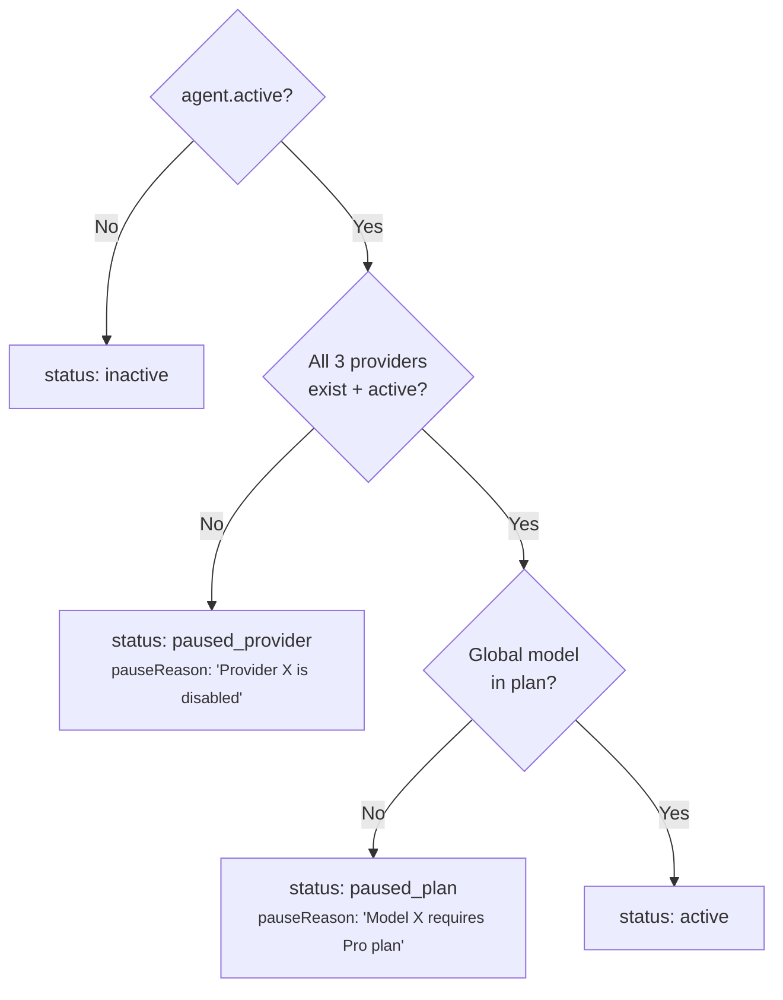

# Plans & Billing

Voicex uses a plan-based access control system. Each organization is linked to a plan that determines model access, agent limits, and feature availability.

---

## Plan Tiers

| | Free | Starter | Pro | Enterprise |
|---|---|---|---|---|
| **Monthly Price** | $0 | $29 | $99 | $499 |
| **Annual Price** | $0 | $290 | $990 | $4,990 |
| **Max Agents** | 1 | 5 | 25 | 999 |
| **Concurrent Calls** | 2 | 10 | 50 | 500 |
| **Max Call Duration** | 5 min | 30 min | 60 min | 120 min |
| **Monthly Minutes** | 60 | 1,000 | 10,000 | 100,000 |
| **Custom Providers** | No | 1 | 5 | 100 |

---

## Model Access by Plan

### LLM Models

| Model | Free | Starter | Pro | Enterprise |
|-------|------|---------|-----|------------|
| `ollama/llama3.2:3b` | Yes | Yes | Yes | Yes |
| `groq/llama-3.3-70b-versatile` | — | Yes | Yes | Yes |
| `groq/llama-3.1-8b-instant` | — | Yes | Yes | Yes |
| `openai/gpt-4o-mini` | — | — | Yes | Yes |
| `openai/gpt-4o` | — | — | Yes | Yes |

### TTS Models

| Model | Free | Starter | Pro | Enterprise |
|-------|------|---------|-----|------------|
| `edge/en-US-AriaNeural` | Yes | Yes | Yes | Yes |
| `edge/en-US-GuyNeural` | Yes | Yes | Yes | Yes |
| `elevenlabs/21m00Tcm4TlvDq8ikWAM` (Rachel) | — | Yes | Yes | Yes |
| `openai/alloy` | — | — | Yes | Yes |
| `openai/nova` | — | — | Yes | Yes |

### STT Models

| Model | Free | Starter | Pro | Enterprise |
|-------|------|---------|-----|------------|
| `deepgram/nova-2` | Yes | Yes | Yes | Yes |

---

## How Plan Access Works

### Model Access Check

Every time an agent is created or updated with a **global** provider's model, the system checks:

```
planModelSet = plan.modelSets[category]   // e.g., plan.modelSets.llm
modelKey = `${providerKey}/${modelId}`    // e.g., "groq/llama-3.3-70b-versatile"
allowed = planModelSet.has(modelKey)       // O(1) Set lookup
```

**Client provider models bypass this check entirely.** If an org has their own OpenAI provider, they can use any model through it regardless of plan.

### Plan Caching

Plans are cached in a 2-level cache for performance:

```
Request → L1 (in-memory Map, 1 min TTL)
  └── MISS → L2 (Redis, 10 min TTL)
              └── MISS → MongoDB
```

The cached plan includes pre-computed `modelSets` (JavaScript `Set` objects) for O(1) lookup:

```typescript
interface CachedPlan extends Plan {
  modelSets: {
    llm: Set<string>;    // O(1) .has() check
    tts: Set<string>;
    stt: Set<string>;
  };
}
```

Cache invalidation: call `invalidatePlanCache(planId)` after updating a plan.

---

## Agent Status & Plan Enforcement

When a user's plan changes (e.g., downgrade from Pro to Free), agents using models above the new plan are automatically **paused** — not deleted.

### Status Computation



### What Happens on Downgrade

1. User downgrades from `pro` to `free`
2. Agent using `groq/llama-3.3-70b-versatile` (requires starter+)
3. Next API call to `GET /agents` computes `status: 'paused_plan'`
4. Agent appears in playground but is **disabled** (non-selectable)
5. Agent detail page shows warning: "Model llama-3.3-70b-versatile requires Starter plan"
6. User can edit the agent to use `ollama/llama3.2:3b` (free tier) → agent becomes active again
7. Voice sessions check this at connection time and reject paused agents

---

## Plan Features

The `features` field controls capability flags:

```typescript
interface PlanFeatures {
  customProviders: boolean;      // Can client add their own providers?
  maxCustomProviders: number;    // How many client providers allowed?
}
```

| Feature | Free | Starter | Pro | Enterprise |
|---------|------|---------|-----|------------|
| `customProviders` | `false` | `true` | `true` | `true` |
| `maxCustomProviders` | 0 | 1 | 5 | 100 |

**Frontend behavior:**
- Free users see "Upgrade to use custom providers" on the providers page
- Starter users see the providers page but can only add 1 provider
- The "Add Provider" button is disabled when at limit

---

## Custom Plans

Plans can be `custom: true` for specific clients (sales deals):

```javascript
{
  slug: "acme-enterprise",
  name: "Acme Enterprise",
  custom: true,
  public: false,          // not shown on pricing page
  models: { /* ... */ },
  limits: { /* ... */ },
  features: { customProviders: true, maxCustomProviders: 50 }
}
```

Custom plans:
- Are created directly in MongoDB or via admin API
- Are not shown on the public pricing page (`public: false`)
- Can have any combination of models and limits
- Are linked to orgs the same way as standard plans

---

## Public Plans API

For the landing page pricing section:

```bash
GET /api/plans
```

Returns all plans where `public: true` and `custom: false`, sorted by price. No authentication required.

---

## Provider Costs

### STT (Speech-to-Text)

| Provider | Cost | Free Tier |
|----------|------|-----------|
| Deepgram | $0.0058/min | $200 credit (~34K min) |

### LLM (Language Model)

| Provider | Cost | Free Tier |
|----------|------|-----------|
| Ollama | Free (self-hosted) | Unlimited |
| Groq | ~$0.05-0.08/M tokens | Free tier available |
| OpenAI | ~$0.15-0.60/M tokens | — |

### TTS (Text-to-Speech)

| Provider | Cost | Free Tier | Production? |
|----------|------|-----------|-------------|
| ElevenLabs | ~$0.30/1K chars | 10K chars/month | Yes |
| OpenAI | $15/1M chars | — | Yes |
| Edge TTS | Free | Unlimited | No (dev only) |

### Cost Estimate (1,000 minutes/month, Starter plan)

| Service | Cost |
|---------|------|
| Deepgram STT | $5.80 |
| Groq LLM | ~$0.50 |
| ElevenLabs TTS | ~$15-30 |
| **Total** | **~$21-36** |
