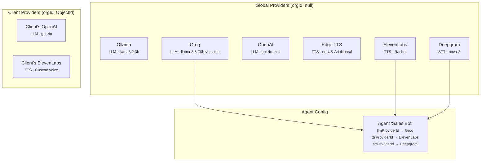
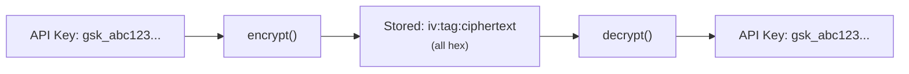
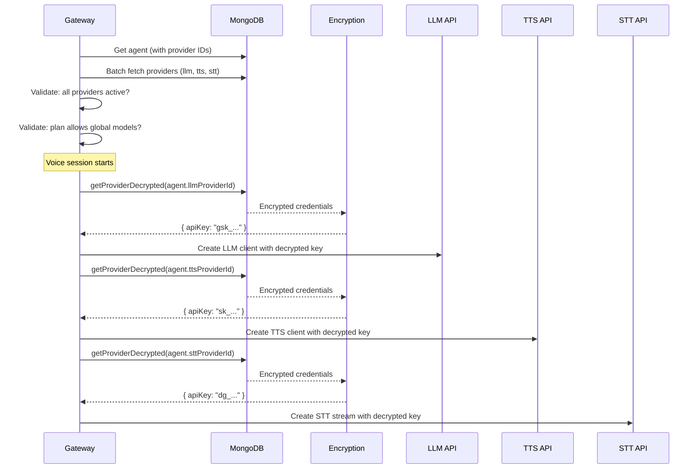

# Providers

Voicex uses a unified provider architecture for STT, LLM, and TTS. All providers — both platform-owned and client-owned — live in a single `providers` collection.

---

## Architecture Overview



### Two Types of Providers

| Type | `orgId` | Created by | Plan check? | Credential source |
|------|---------|-----------|-------------|-------------------|
| **Global** | `null` | Platform admin via seed script | Yes (plan must include model) | Platform env vars |
| **Client** | `<ObjectId>` | Client via dashboard | No (always allowed) | Client-provided keys |

### Why Unified?

- **Single collection** simplifies queries — agents reference `providers._id` regardless of type
- **Same encryption** for all credentials
- **Same model format** (`providerKey/modelId`) for plan access checks
- **Delete guard** works uniformly — can't delete any provider if agents reference it

---

## Provider Registry

The `provider_registry` collection is a **read-only catalog** of all supported provider types. It tells the frontend what options exist when a client creates a new provider.

Seeded by `scripts/seed-providers.ts`. Example entries:

| Category | Provider Key | Display Name | Requires Key? | Models |
|----------|-------------|-------------|---------------|--------|
| llm | groq | Groq | Yes | llama-3.3-70b-versatile, llama-3.1-8b-instant, ... |
| llm | openai | OpenAI | Yes | gpt-4o-mini, gpt-4o, ... |
| llm | ollama | Ollama | No | llama3.2:3b, ... |
| tts | elevenlabs | ElevenLabs | Yes | Rachel, Bella, ... |
| tts | openai | OpenAI TTS | Yes | alloy, nova, shimmer, ... |
| tts | edge | Edge TTS | No | en-US-AriaNeural, ... |
| stt | deepgram | Deepgram | Yes | nova-2 |

---

## Credential Encryption

All provider credentials are encrypted at rest using **AES-256-GCM**.

### How It Works



| Parameter | Value |
|-----------|-------|
| Algorithm | AES-256-GCM |
| Key | `ENCRYPTION_KEY` env var (64-char hex = 32 bytes) |
| IV | 12 random bytes (generated per encryption) |
| Auth tag | 16 bytes |
| Storage format | `iv_hex:authTag_hex:ciphertext_hex` |

### Generate an Encryption Key

```bash
node -e "console.log(require('crypto').randomBytes(32).toString('hex'))"
```

### When Is Decryption Used?

Credentials are decrypted **only at runtime** when:
1. A voice session starts (`voice-session.service.ts`)
2. The system needs to call the LLM, TTS, or STT API
3. `getProviderDecrypted()` fetches the provider and decrypts in memory

Credentials are **never** returned to the frontend — all API responses strip the `credentials` field.

---

## Supported Providers

### STT (Speech-to-Text)

| Provider | Key | Cost | Latency | Free Tier |
|----------|-----|------|---------|-----------|
| **Deepgram** | `deepgram` | $0.0058/min | ~100ms | $200 credit (~34K min) |

Deepgram is currently the only STT provider. It uses the Nova-2 model with these features:
- `interim_results` — real-time partial transcriptions
- `endpointing: 300` — 300ms silence = end-of-speech
- `utterance_end_ms: 1000` — fallback end-of-utterance
- `vad_events` — voice activity detection for fast interrupts
- `speech_final` — instant trigger when speaker finishes

### LLM (Language Model)

| Provider | Key | Models | Cost | First Token |
|----------|-----|--------|------|-------------|
| **Groq** | `groq` | llama-3.3-70b-versatile, llama-3.1-8b-instant | ~$0.05/M tokens | ~200ms |
| **OpenAI** | `openai` | gpt-4o-mini, gpt-4o | ~$0.15-0.60/M tokens | ~500ms |
| **Ollama** | `ollama` | llama3.2:3b (local) | Free | 1-3s |

All LLM providers implement the same interface: `streamCompletion(messages, onToken, signal?)`.

### TTS (Text-to-Speech)

| Provider | Key | Cost | Quality | Latency |
|----------|-----|------|---------|---------|
| **ElevenLabs** | `elevenlabs` | ~$0.30/1K chars | Best (most natural) | ~300ms |
| **OpenAI** | `openai` | $15/1M chars | Good | ~400ms |
| **Edge TTS** | `edge` | Free | Decent | ~200ms |
| **System** | `system` | Free | Basic | ~500ms+ |

All TTS providers implement: `streamAudio(text, onChunk, signal?)`.

> **Warning:** Edge TTS uses an unofficial Microsoft endpoint with no SLA. Dev/testing only.

---

## Provider CRUD API

### List Provider Registry

```bash
GET /api/dashboard/providers/registry
```

Returns the catalog of supported provider types, models, and settings.

### List Providers

```bash
# All providers (global + client)
GET /api/dashboard/providers

# Client providers only
GET /api/dashboard/providers?client=true
```

Response excludes `credentials` field.

### Get a Provider

```bash
GET /api/dashboard/providers/:id
```

Returns provider details (no credentials).

### Create a Client Provider

```bash
POST /api/dashboard/providers
Content-Type: application/json

{
  "category": "llm",
  "providerKey": "openai",
  "name": "My OpenAI",
  "credentials": { "apiKey": "sk-..." },
  "models": [
    { "modelId": "gpt-4o", "label": "GPT-4o" }
  ],
  "settings": {}
}
```

**Checks performed:**
1. Plan must allow custom providers (`features.customProviders = true`)
2. Client must not exceed `features.maxCustomProviders` limit
3. Provider name must be unique per org + category + providerKey

### Update a Client Provider

```bash
PATCH /api/dashboard/providers/:id
Content-Type: application/json

{
  "name": "My OpenAI (Updated)",
  "active": false
}
```

Only client-owned providers can be updated. If you deactivate a provider, any agents using it will show `status: 'paused_provider'`.

### Delete a Client Provider

```bash
DELETE /api/dashboard/providers/:id
```

**Delete guard:** If any agents reference this provider (via `llmProviderId`, `ttsProviderId`, or `sttProviderId`), the request is rejected with a 409 response listing the affected agents.

---

## Model Search API

A paginated search endpoint for finding models across all providers:

```bash
GET /api/dashboard/models/search?category=llm&query=gpt&skip=0&limit=10
```

**Response:**

```json
{
  "items": [
    {
      "providerId": "...",
      "providerKey": "openai",
      "providerName": "OpenAI",
      "modelId": "gpt-4o-mini",
      "label": "GPT-4o Mini",
      "source": "global",
      "allowed": true,
      "requiredPlan": null
    },
    {
      "providerId": "...",
      "providerKey": "openai",
      "providerName": "OpenAI",
      "modelId": "gpt-4o",
      "label": "GPT-4o",
      "source": "global",
      "allowed": false,
      "requiredPlan": "pro"
    }
  ],
  "total": 15,
  "skip": 0,
  "limit": 10
}
```

**Behavior:**
- Results from the user's plan appear first (sorted by plan allowance)
- Client provider models always show as `allowed: true`
- Models above the user's plan show `allowed: false` with `requiredPlan` set
- Used by the `ModelSelect` component in the agent editor

---

## How Agents Use Providers

When an agent is used in a voice session:



---

## Seeding Global Providers

Global providers are seeded from environment variables using:

```bash
bash scripts/seed-global-providers.sh
```

This reads API keys from `.env.local` and creates provider documents with encrypted credentials. The script is idempotent — existing providers are skipped.

### Providers Created

| Category | Provider Key | Name | Env Var for Key |
|----------|-------------|------|-----------------|
| llm | ollama | Ollama (Local) | — (no key needed) |
| llm | groq | Groq Cloud | `GROQ_API_KEY` |
| llm | openai | OpenAI | `OPENAI_API_KEY` |
| tts | edge | Edge TTS (Free) | — (no key needed) |
| tts | elevenlabs | ElevenLabs | `ELEVENLABS_API_KEY` |
| tts | openai | OpenAI TTS | `OPENAI_API_KEY` |
| stt | deepgram | Deepgram | `DEEPGRAM_API_KEY` |
