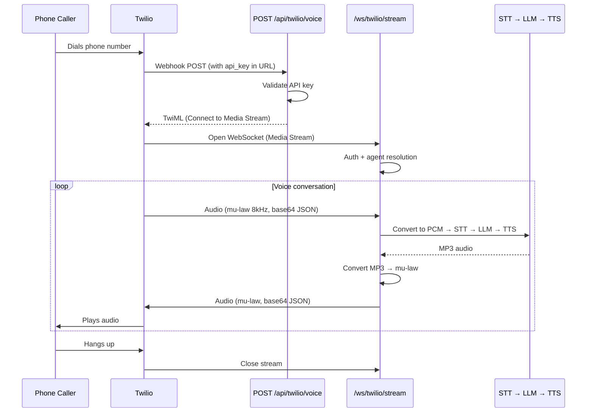

# Twilio Setup

Connect phone calls to the AI assistant via Twilio Media Streams.

---

## How It Works



---

## Prerequisites

- A [Twilio account](https://www.twilio.com/try-twilio) with a phone number
- Your Voicex backend accessible from the internet (for the webhook)
- An API key from the Voicex dashboard

---

## Configuration

Set in `backend/.env.local`:

```bash
# Your backend's public URL (no trailing slash)
TWILIO_APP_URL=https://api.your-domain.com
```

---

## Twilio Console Setup

1. Go to [Twilio Console](https://console.twilio.com) → Phone Numbers → Manage → Active Numbers
2. Click your phone number
3. Under **Voice Configuration**:
   - **A call comes in:** Webhook
   - **URL:** `https://api.your-domain.com/api/twilio/voice?api_key=vx_a1b2c3d4e5f6...`
   - **Method:** POST

Optionally add `&agent_id=664a...` to use a specific agent.

---

## Audio Format

Twilio Media Streams use **mu-law encoding at 8kHz**. The backend automatically handles conversion:

| Direction | Twilio format | Backend format | Conversion |
|-----------|--------------|----------------|------------|
| Incoming | mu-law 8kHz (base64 JSON) | PCM 16-bit 16kHz | `alawmulaw` decoder |
| Outgoing | mu-law 8kHz (base64 JSON) | MP3 (from TTS) | FFmpeg MP3 → mu-law |

---

## Testing Locally

Since Twilio needs to reach your server over the internet, use ngrok for local testing:

### Step 1: Start ngrok

```bash
ngrok http 3001
```

Note the HTTPS URL (e.g., `https://abc123.ngrok.io`).

### Step 2: Configure backend

```bash
TWILIO_APP_URL=https://abc123.ngrok.io
```

### Step 3: Update Twilio webhook

Set the webhook URL to:

```
https://abc123.ngrok.io/api/twilio/voice?api_key=vx_a1b2c3d4e5f6...
```

### Step 4: Call your Twilio number

The AI assistant will answer.

---

## Multi-Tenant Setup

Each client uses their own Twilio account and phone number. They configure their Twilio webhook to point to your Voicex server with their unique API key:

```
https://your-voicex-server.com/api/twilio/voice?api_key=CLIENT_API_KEY
```

**What the client provides:**
- Their own Twilio account + phone number
- Their Voicex API key (from the dashboard)

**What you provide:**
- AI processing (STT, LLM, TTS)
- Agent configuration and management

**Usage tracking:** All calls are tracked per organization via the `orgId` resolved from the API key.

---

## Agent Selection for Phone Calls

By default, the system uses the org's first active agent. To use a specific agent, add `agent_id` to the webhook URL:

```
https://your-server.com/api/twilio/voice?api_key=vx_...&agent_id=664a1234abcd
```

This lets clients assign different phone numbers to different agents (e.g., sales line vs support line).

---

## Limitations

- **Audio quality:** Phone audio is 8kHz mu-law (lower quality than browser 16kHz PCM). STT accuracy may be slightly lower.
- **Latency:** Additional Twilio network hop adds ~50-100ms compared to direct WebSocket.
- **Codec conversion:** MP3 → mu-law conversion uses FFmpeg and adds a small processing overhead.
