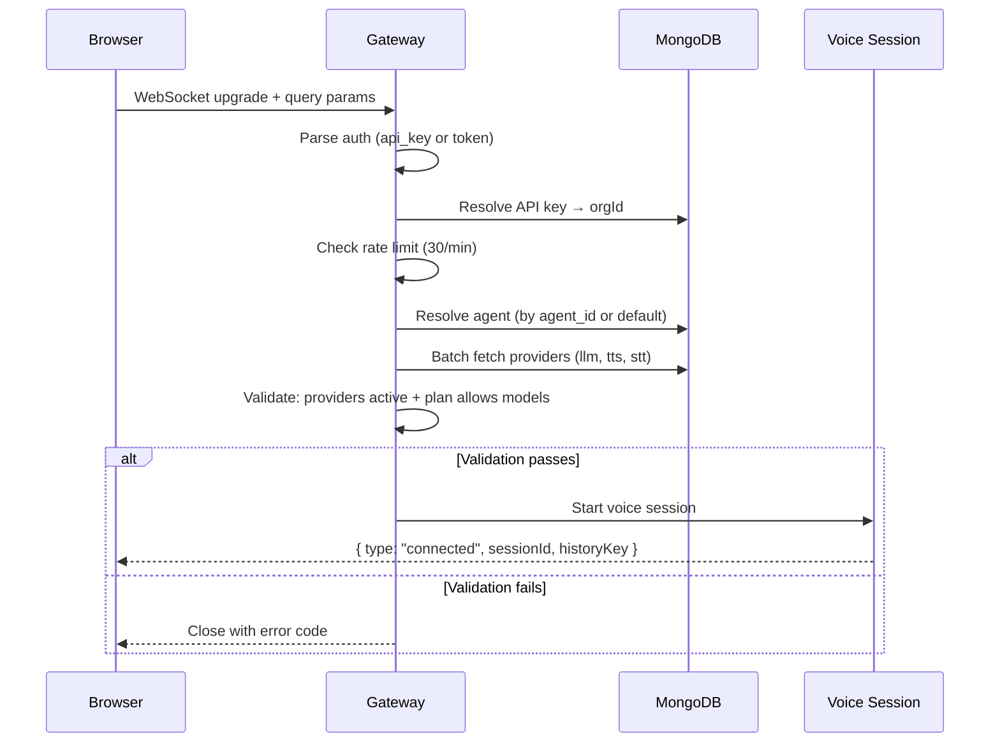

# WebSocket API

The voice assistant communicates over WebSocket. Audio is sent as binary frames; control messages are JSON.

---

## Endpoints

| Endpoint | Purpose |
|----------|---------|
| `ws://localhost:3001/ws/voice` | Browser voice connections |
| `ws://localhost:3001/ws/twilio/stream` | Twilio Media Stream connections |

---

## Connection

```
ws://localhost:3001/ws/voice?api_key=<key>&agent_id=<id>&session_id=<id>
```

### Query Parameters

| Param | Required | Description |
|-------|----------|-------------|
| `api_key` | No* | API key for authentication |
| `token` | No* | JWT token for authentication |
| `agent_id` | No | Specific agent to use (ObjectId hex). If omitted, uses the org's first active agent |
| `session_id` | No | Resume a previous conversation session (preserves history) |

*At least one auth method is required if API_KEYS is configured.

### Connection Flow



### Error Close Codes

| Code | Meaning |
|------|---------|
| 4001 | Unauthorized (invalid auth) |
| 4002 | STT not configured |
| 4003 | Model not allowed by plan |
| 4004 | Provider not found or inactive |
| 4005 | Agent not found |
| 4029 | Rate limited |

---

## Server → Client Messages

### `connected`

Sent immediately after successful connection and validation.

```json
{
  "type": "connected",
  "sessionId": "uuid-here",
  "historyKey": "session-key-for-reconnect",
  "agentId": "664a...",
  "agentName": "Sales Bot",
  "timestamp": 1708000000000
}
```

Save `historyKey` and pass it as `session_id` to resume the conversation later.

### `transcript`

Real-time transcription of user or assistant speech.

```json
{
  "type": "transcript",
  "payload": {
    "text": "Hello, how are you?",
    "isFinal": true,
    "timestamp": 1708000000000,
    "role": "user"
  }
}
```

| Field | Type | Description |
|-------|------|-------------|
| `text` | string | Transcribed text |
| `isFinal` | boolean | `true` = finalized, `false` = interim (may change) |
| `role` | `"user"` \| `"assistant"` | Who said it |
| `timestamp` | number | Unix timestamp in ms |

**Interim transcripts** (`isFinal: false`) update as the user speaks. Replace the previous interim with the latest one.

### `audio` (binary)

MP3 audio of the assistant's response. Sent as **binary WebSocket frames** (not JSON).

Decode with the Web Audio API:

```javascript
ws.onmessage = (event) => {
  if (event.data instanceof ArrayBuffer) {
    audioContext.decodeAudioData(event.data).then(playBuffer);
  } else {
    const msg = JSON.parse(event.data);
    // handle JSON messages
  }
};
```

### `audioEnd`

Sent when the assistant finishes speaking a complete response (all sentences played).

```json
{
  "type": "audioEnd"
}
```

### `audioStop`

Sent when the assistant is **interrupted** by the user. Client should immediately stop audio playback.

```json
{
  "type": "audioStop"
}
```

### `error`

```json
{
  "type": "error",
  "payload": {
    "message": "Failed to start speech recognition"
  }
}
```

### `pong`

Response to client `ping`.

```json
{
  "type": "pong",
  "timestamp": 1708000000000
}
```

---

## Client → Server Messages

### Audio (binary)

Send microphone audio as **binary WebSocket frames** — raw PCM 16-bit, 16kHz, mono.

```javascript
// AudioWorklet sends ArrayBuffer chunks
ws.send(pcmArrayBuffer);
```

### `ping`

Keep-alive ping.

```json
{
  "type": "ping"
}
```

---

## Audio Format

| Direction | Format | Sample Rate | Encoding |
|-----------|--------|-------------|----------|
| Client → Server | PCM 16-bit | 16kHz | Binary (raw bytes) |
| Server → Client | MP3 | 24kHz | Binary (complete MP3 per sentence) |

The server sends one complete MP3 per sentence. Each sentence is playable independently — queue them for sequential playback.

---

## Session Persistence

Conversations persist across reconnections using the session key:

1. On `connected`, save the `historyKey`
2. On reconnect, pass it as `session_id` query param
3. The server loads the previous conversation history from Redis (24h TTL)
4. The AI continues where it left off

```javascript
// Save on connect
ws.onmessage = (event) => {
  const msg = JSON.parse(event.data);
  if (msg.type === 'connected') {
    localStorage.setItem('voicex_session_id', msg.historyKey);
  }
};

// Use on reconnect
const sessionId = localStorage.getItem('voicex_session_id');
const ws = new WebSocket(`ws://localhost:3001/ws/voice?token=${token}&session_id=${sessionId}`);
```

---

## Full Client Example

```javascript
const audioContext = new AudioContext({ sampleRate: 24000 });
let audioQueue = [];

// Connect
const ws = new WebSocket('ws://localhost:3001/ws/voice?api_key=vx_abc123&agent_id=664a...');

ws.onmessage = (event) => {
  // Binary = audio
  if (event.data instanceof ArrayBuffer || event.data instanceof Blob) {
    const buffer = event.data instanceof Blob
      ? await event.data.arrayBuffer()
      : event.data;
    audioContext.decodeAudioData(buffer).then((decoded) => {
      const source = audioContext.createBufferSource();
      source.buffer = decoded;
      source.connect(audioContext.destination);
      source.start(0);
    });
    return;
  }

  // JSON = control message
  const msg = JSON.parse(event.data);

  switch (msg.type) {
    case 'connected':
      console.log('Session:', msg.sessionId);
      localStorage.setItem('session_id', msg.historyKey);
      break;

    case 'transcript':
      console.log(`[${msg.payload.role}] ${msg.payload.text}`);
      break;

    case 'audioStop':
      // User interrupted — stop all playing audio
      break;

    case 'audioEnd':
      // Assistant finished speaking
      break;

    case 'error':
      console.error(msg.payload.message);
      break;
  }
};

// Send microphone audio (from AudioWorklet)
function sendAudio(pcmArrayBuffer) {
  if (ws.readyState === WebSocket.OPEN) {
    ws.send(pcmArrayBuffer);
  }
}
```

---

## Rate Limiting

- **30 connections per minute** per client (by clientId or IP)
- Tracked via Redis (distributed) or in-memory Map (single instance)
- Exceeding the limit closes the WebSocket with code `4029`

---

## Interruption Behavior

When the user speaks while the assistant is talking:

1. STT detects user speech
2. Server checks interruption sensitivity threshold
3. If met: `audioStop` sent to client, LLM/TTS pipeline aborted
4. New pipeline starts with the user's text
5. 800ms cooldown after pipeline completion (echo suppression)

The `interruptionSensitivity` agent setting controls how many characters of user speech are needed before triggering an interruption:

| Sensitivity | Chars needed | Behavior |
|-------------|-------------|----------|
| `low` | 5 | Less sensitive, fewer false interrupts |
| `medium` | 2 | Balanced (default) |
| `high` | 1 | Very responsive, more false interrupts |
